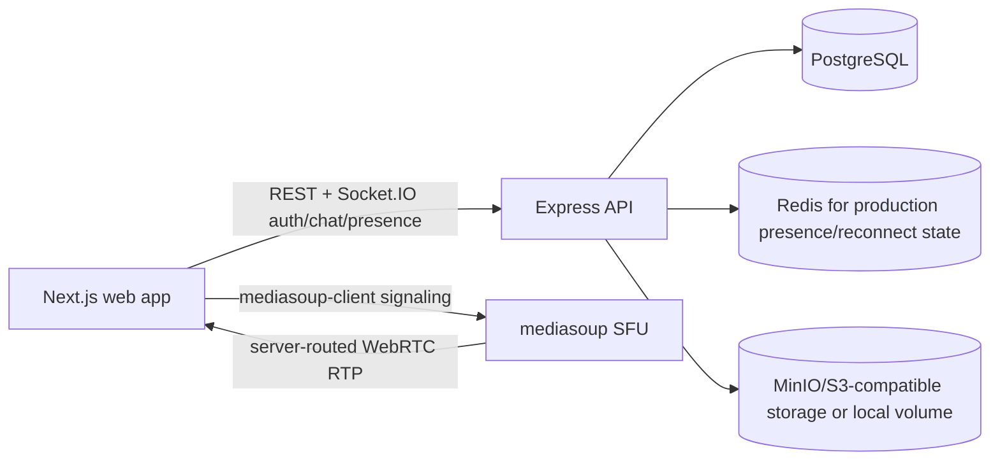

# SightBridge

SightBridge is a self-hosted real-time video support platform where agents can see, guide, record, and resolve customer issues without third-party video APIs.

## Architecture



The Mermaid source is also available at `docs/architecture.mmd` for rendering into an image/PDF. Deployment notes for Vercel, Neon, and the long-running API/SFU services are in `docs/deployment.md`.

## Local run

```bash
cp .env.example .env
# local demo credentials are unsafe for production; change all secrets before exposing beyond localhost
# production startup blocks SEED_AGENT_PASSWORD=password123, localhost-only secrets, and missing ANNOUNCED_IP
docker compose up --build
```

Open <http://localhost:3000>. The compose seed step creates the local agent from `SEED_AGENT_EMAIL` and `SEED_AGENT_PASSWORD` in `.env`.

Default local demo login (local development only; production startup rejects `SEED_AGENT_PASSWORD=password123`):

- Email: `agent@sightbridge.local`
- Password: `password123`

## Monorepo layout

- `apps/web`: Next.js frontend for agent login, dashboard, customer join, active call, history, and admin live sessions.
- `apps/api`: Express API with Socket.IO signaling for auth, sessions, chat, presence, uploads, recording metadata, health, and Prometheus metrics.
- `apps/media-server`: mediasoup SFU that verifies signaling JWTs and creates routers, WebRTC transports, producers, and consumers so media is routed through SightBridge servers.
- `packages/shared`: shared TypeScript constants and Zod schemas.

## API routes

- `GET /health`
- `GET /metrics`
- `POST /auth/login`
- `POST /sessions`
- `GET /sessions`
- `GET /sessions/:id/history`
- `POST /sessions/:id/end`
- `POST /sessions/join`
- `POST /sessions/:id/upload`
- `POST /sessions/:id/recordings/start`
- `POST /sessions/:id/recordings/browser-upload`
- `GET /sessions/:id/objects/:folder/:name`

## Database schema

The Prisma schema and SQL migration define persistent `User`, `Session`, `SessionParticipant`, `SessionEvent`, `ChatMessage`, `ChatAttachment`, and `Recording` tables. Session history, events, chat, files, participants, and recording metadata survive API restarts because they are stored in PostgreSQL.

## Security and validation

- Agent-only routes use JWT auth plus server-side role checks.
- Customers receive scoped JWTs only after joining with a valid invite token.
- Invite tokens are random, expirable, single-use, and stored as HMAC hashes.
- Request bodies are validated with shared Zod schemas.
- Uploads validate MIME type and size, sanitize display names, and store generated object keys.
- CORS origins and secrets are configured through environment variables.
- Login and session creation are rate-limited.
- Object downloads verify the authenticated requester is an actual participant for that session and that the requested object belongs to that session.
- Production startup blocks the demo seed password, localhost/demo secrets, and missing public `ANNOUNCED_IP`.

## Recording limitation

SightBridge routes live media through the self-hosted mediasoup SFU. Recording currently uses an explicit browser `MediaRecorder` fallback initiated by the agent and uploads a real WebM file back to the API. A production SFU-side mixed recording pipeline is not included in this hackathon implementation.

## Demo script

1. Start all services: `docker compose up --build`.
2. Open the web app and log in as the seeded agent.
3. Create a support session and copy the generated invite link.
4. Open the invite link in another browser or incognito window.
5. Join as the customer and grant camera/microphone permissions.
6. Confirm both browsers exchange media through the mediasoup SFU.
7. Send chat messages both ways.
8. Upload an image, PDF, text file, or document attachment.
9. Toggle mic and camera controls.
10. As the agent, start and stop recording.
11. End the call.
12. Open session history and review participants, messages, attachments, recording status, and event logs.

## Manual audit checklist

- Invalid, expired, reused, and ended invite links return clear errors.
- Customers cannot create sessions, end sessions, or start/stop recordings because server-side role checks reject those calls.
- Chat messages and attachments are persisted in PostgreSQL.
- Session lifecycle events are persisted and visible in history.
- `/metrics` exposes active sessions, connected participants, created sessions, session errors, reconnect count, and active recordings.
- The media server exposes mediasoup transport/producer/consumer flows for server-routed media.
- The browser records a real WebM file during the fallback recording flow.

## Deployment

For a hosted demo, deploy `apps/web` to Vercel, use Neon Postgres free tier for `DATABASE_URL`/`DIRECT_URL`, and deploy `apps/api` plus `apps/media-server` on a long-running Node host with UDP support. Vercel is excellent for the web app, but the self-hosted mediasoup SFU must run outside serverless functions. See `docs/deployment.md`.

## Production WebRTC and TURN

Restrictive NATs and corporate firewalls often require TURN relay. Set these variables for production media deployments and point them at your coturn or managed TURN service:

- `ANNOUNCED_IP`: public routable IP or DNS-resolved address advertised by mediasoup. Required when `NODE_ENV=production`.
- `TURN_URL`: comma-separated TURN URLs, such as `turn:turn.example.com:3478?transport=udp,turns:turn.example.com:5349?transport=tcp`.
- `TURN_USERNAME`: TURN credential username.
- `TURN_PASSWORD`: TURN credential password.

The media server passes configured TURN ICE servers to browser mediasoup transports and still exposes UDP ports `40000-40100` for direct SFU connectivity when available.

## Known limitations

- TURN/coturn is documented and configurable but not bundled as a compose service.
- The recording fallback captures the agent browser stream, not a server-side SFU mixed composition.
